## Prueba_Inditex_API
### Descripción general
API basada en la prueba de Inditex bajo arquitectura hexagonal, Java 17 y Spring 3.2.0, bbdd H2, RedisCache,
OpenAPI para la realización de pruebas y manejo de excepciones.
### Tecnologías Utilizadas
- Java 17
- Spring Boot
- H2
- RedisCache
- OpenAPI
- Flyway migration
### Requisitos
- Java 17
- Redis Server (instrucciones rápidas más abajo)
- Maven
### Notas sobre el proyecto
- He querido centrarme en el endpoint de la prueba bajo las instrucciones de entrada y salida que se pide en la prueba.
- También lo he querido realizar de la manera más versátil y genérica posible, para que este mismo endpoint sirviese para realizar
búsquedas con cualquier filtro que el usuario desease asignar y no solo lo que pide la prueba.
- He considerado omitir la lógica de servicio de la entity Brand, para no repetir información innecesaria para la prueba.
### Pautas a seguir
- Hacer git clone [https://github.com/fran199017/Prueba_Inditex_API.git](https://github.com/fran199017/prueba_prices_api.git)
- Abrir el proyecto en la raiz ../pruebainditex
- Hacer mvn clean package
- mvn clean test ( para ver el coverage de Jacoco situado en target/site/jacoco/index.html)
- Ejecutar java -jar target/pruebainditex-0.0.1-SNAPSHOT.jar
### Pautas a seguir para RedisCache
- Descargar y descomprimir el .zip (en Windows) https://github.com/microsoftarchive/redis/releases
- Ejecutar redis-cli.exe para levantar el server en el puerto por defecto.
- Para verificar que efectivamente se ha guardado informacion tras la petición se puede utilizar redis-cli-exe
- Usar el comando GET id (del elemento guardado). Ejemplo al final del Readme.

### BBDD H2 instrucciones
- URL: http://localhost:8080/h2-console
- bbdd: jdbc:h2:mem:testdb
- username: sa
- password:

### Swagger URL
http://localhost:8080/swagger-ui/index.html

### Endpoint de la prueba (hay ejemplos al final del readme)
http://localhost:8080/swagger-ui/index.html#/prices-controller/findAll
#### NOTA IMPORTANTE!!
- Se ha decidido utilizar cuando se filtra por priority a TRUE el entityManager para realizar la consulta porque tras analizar la prueba y realizar
  los Specification vi, que había que filtrar el resultado a 1 elemento, con la imposibilidad de hacer un LIMIT al Specification y escogiendo em para
  coger esos filtros y realizar la query. Obviamente sería mas eficiente hacer un @Query, pero he querido hacer un endpoint que sea muy versátil a la hora de realizar pruebas y encontrandome con este problema despues de ver que habia que filtrar a 1 único resultado.
- NOTA: Si se utiliza alguna otro endpoint, los tests podrían fallar al haber cambiado campos de la prueba.
1) Para este endpoint (aunque queda explicado en OpenAPI), todos los campos son String, para poder aplicarles ciertos filtros y orderByPriority si se desea filtrar por prioridad o no para mayor flexibilidad al endpoint.
2) Los filtros son los siguientes: eq:, neq:, lt:, gt:, y bw: (este último solo para fechas).
3) Un ejemplo del campo date con formato yyyyMMddHHmmss podría ser eq:20201230235959 (. Este ejemplo aplicará un filtro EQUALS sobre el campo startDate. (yo habría aplicado 2 campos fechas para decidir si queremos comparar startDate, 
endDate o ambos pero he querido realizar la prueba lo más ajustada posible pero haciéndola versátil).
4) Otro ejemplo de fecha podría ser bw:20221215000000 que realizará una bésqueda entre los campos startDate y endDate.

### Endpoint findById
http://localhost:8080/api/v1/prices/{id}
- NOTA: Tiene una implementación con RedisCache para realizar consultadas cacheadas en Redis. 
(explicado en el apartado de Redis)
### Resto de endpoints
- Son opcionales en la prueba pero los he insertado porque forman parte de una API REST. Para los campos fecha siguen el mismo formato yyyyMMddHHmmss.

### Manejo de excepciones customizadas
- Se puede probar a aplicar un filtro erroneo en el findAll -> Ejemplo ab:yyyyMMddHHmmss
- Se puede probar a no aplicar ningun filtro en el findAll ->  Ejemplo yyyyMMddHHmmss
- Se puede probar a aplicar una fecha "válida" para el @RequestBody pero inválida en conversión -> Ejemplo: eq:20210632000000 (día 32)
- Se puede probar a insertar como brandId (foreign key de Prices) una brandId inexistente -> Ejemplo brandId:5

### Ejemplos findAll ( el endpoint de la prueba)
Test 1: petición a las 10:00 del día 14 del producto 35455 para la brand 1 (ZARA)
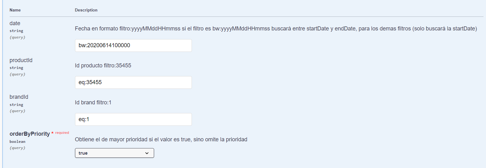
Test 2: petición a las 16:00 del día 14 del producto 35455 para la brand 1 (ZARA) y su respuesta 
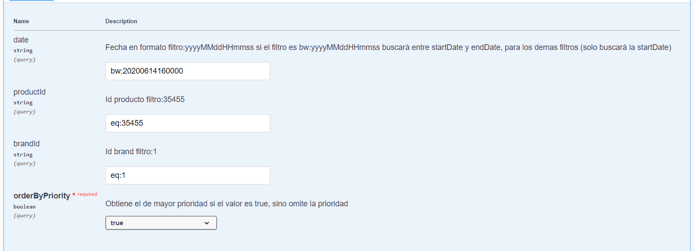
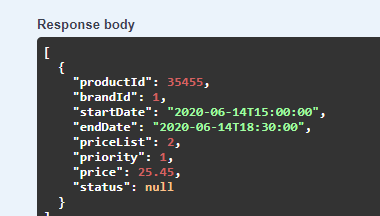
- Test 2 pero sin tener en cuenta la prioridad y su respuesta(devuelve ambos elementos, al haber puesto la variable de prioridad a FALSE)
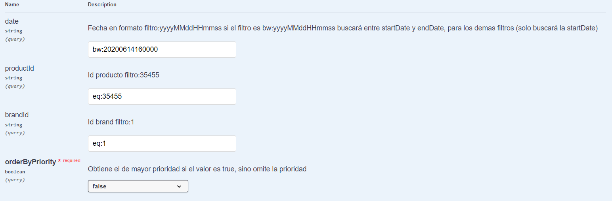
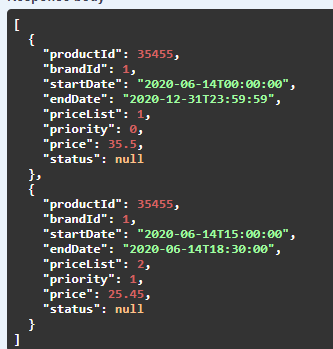
- Otro ejemplo cualquiera válido
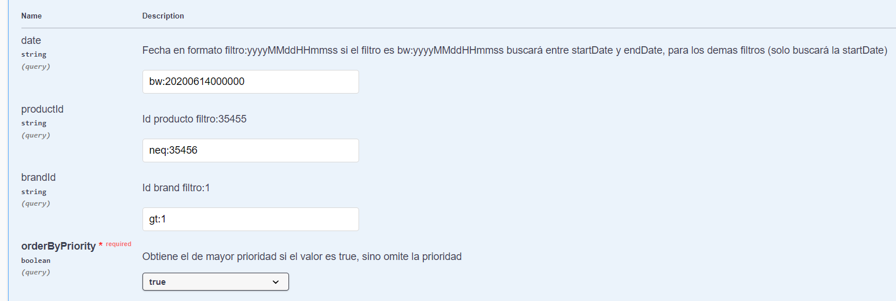
- Ejemplo sin filtro ninguno, devuelve todos los elementos
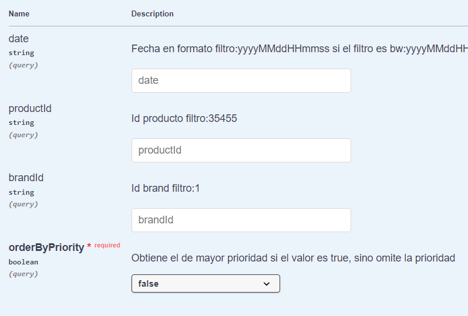 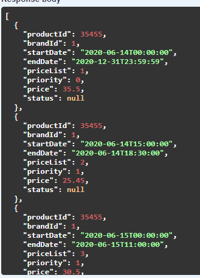
- 
### Ejemplos Redis cache
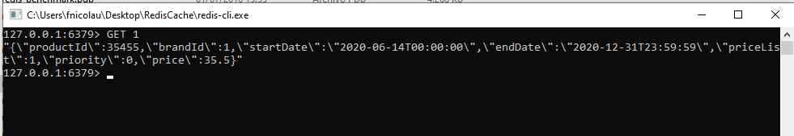
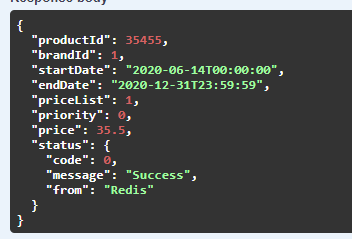
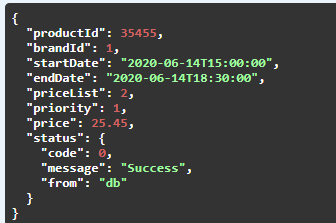

